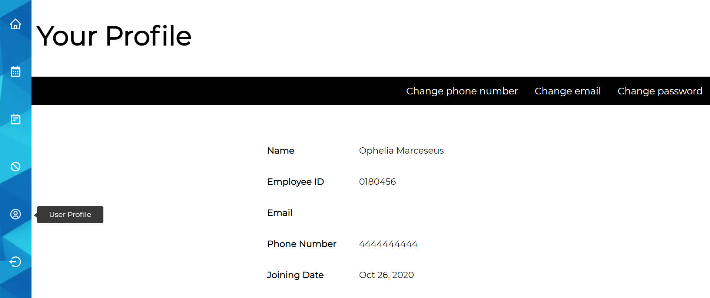

# Employee-Management-System

## Introduction

Employee management system is a multi-user react app that is used to manage the organisational tasks of on-campus invigilators' shifts for both admin and employee side.

## Packages used

1. **Employee**

   1. react-redux
   2. moment
   3. react-big-calendar
   4. react-icons
   5. react-tooltip

2. **Admin**
   1. bcrypt
   2. dotenv
   3. moment
   4. mongodb
   5. nodemailer

## Environment variables

Environment variables are required in the backend directory to make sure that admin part of the application runs properly. Two main types of environment variables that are needed are given below. For the format of the variables, please see <code>handlers.js</code> in the backend folder.

1. **Mongo URI**- You need a mongodb URI to connect to your database to ensure the proper functioning of your application.
2. **Email ID and password of your email account**-This is needed to make the email feature run properly.

## Running the application

1. Do yarn install in both <code>frontend</code> and <code>backend</code> folders.
2. In the package.json file of <code>frontend</code> folder, add <code>"start": "react-scripts start"</code>.
3. In the package.json file of <code>backend</code> folder, add <code>"dev": "nodemon server.js"</code>.
4. Go to the <code>frontend</code> and <code>backend</code> directories in two separate terminals and run <code>yarn start</code> to run the frontend server, and <code>yarn dev</code> to run the backend server.

With these steps your application will run smoothly! Congratulations!

## Current features

1. **Employee**

   1. Ability to see shifts in a calendar format
   2. Ability to see shifts in tabular and sorted format with additional features of cancelling the shift.
   3. Ability to take cancelled shifts from the list of cancelled shifts.
   4. Ability to see your personal profile, and change contact details and password.
   5. Ability to register as a new user if your employee ID is already created by the admin.

2. **Admin**
   1. Ability to see all the employees sorted with their status.
   2. Ability to see an employee profile and their shifts.
   3. Ability to create a new employee from which that particular new employee can register after receiving the email from the admin of their employee ID.
   4. Ability to create a new shifts for all active employees.
   5. Ability to change the date and time for any upcoming shifts, with cancel and delete functionality.
   6. Ability to change the current status of an employee to retired or archived.
   7. Ability to change admin password.
   8. Ability to send out mass emails to invigilators for their upcoming shifts within a particular date range.

## Upcoming features

1. **Employee**

   1. Swap functionality where the users can swap their shifts among each other.
   2. Contact form the invigilators to send emails to the admins with their queries straight from their portal.
   3. Calculation method of number of hours worked within a selected date range.
   4. Pagination for shifts page.
   5. 48 hours of maximum time limit from the shift time to cancel the shift.

2. **Admin**
   1. Addition of different admin roles where some functionality will not be present for sub-admins.
   2. Making new admin form to add sub admins.
   3. Filter bar to for employee list to filter the list by name, employee ID, or date of joining.
   4. Filter bar for employee shifts list to filter the shifts by particular dates, by name or employee IDs.
   5. Pagination for employee shifts and employee list pages.
   6. Putting in Retire and archive dates in the employee data.
   7. Sorting shifts by date and time, and present them in calendar format.

## Images

### Employee portal

### Admin portal

